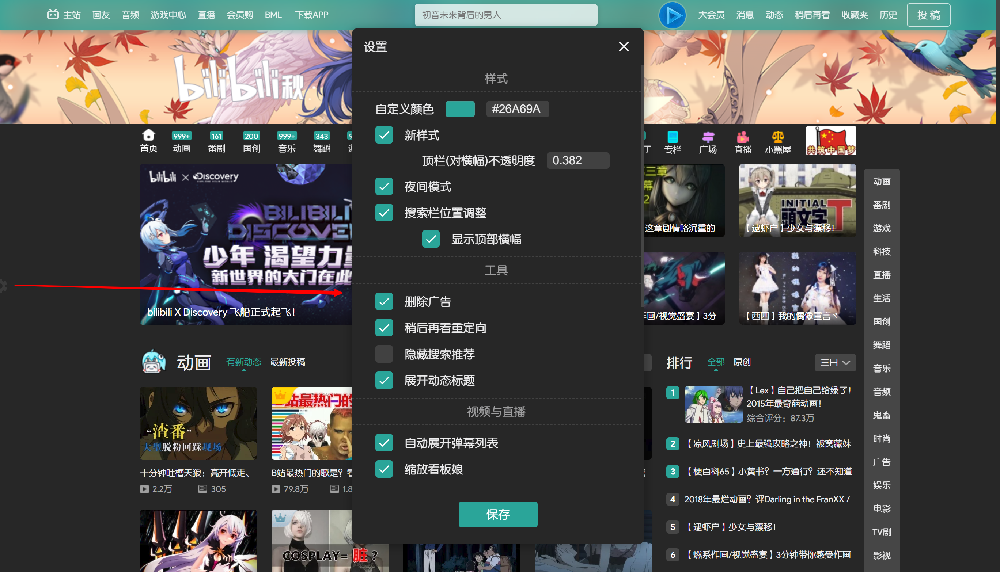
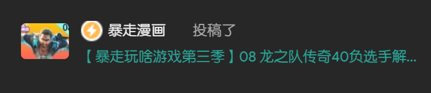
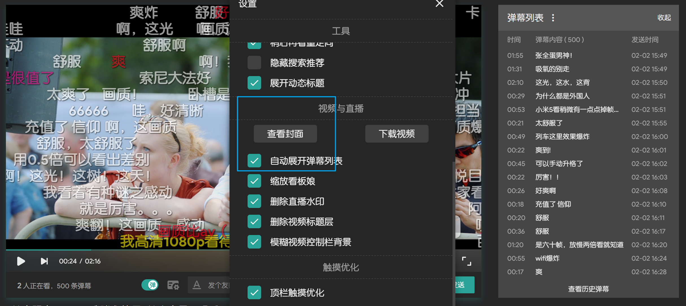
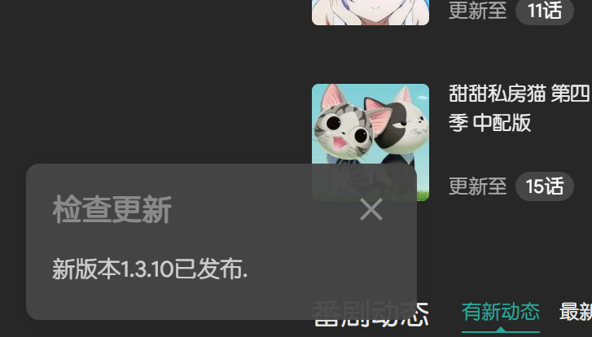

# Bilibili-Evolved
增强哔哩哔哩Web端体验的油猴脚本.

# 安装
需要浏览器拥有[Tampermonkey](https://tampermonkey.net/)或同类插件.

正式发布的版本,最稳定,更新频率较慢.

新增内容测试的地方,更新频率快,但功能不稳定.

内置所有依赖项以提高加载速度,体积较大,可以不受GitHub服务器不稳定的影响. 由于任何依赖项更新后此脚本也需更新,所以更新频率会高于正式版.

兼备预览版和离线版的特点.

# 设置
脚本启用后,在网页左侧中央会有一个齿轮图标,点击即可打开设置.

**设置保存后,需要刷新网页才能生效.**

## 默认值
### 样式
- 新样式: `开启`
    - 自定义颜色: `浅蓝色(#00A0D8)`
    - 顶栏(对横幅)不透明度: `0.382`
    - 夜间模式: `关闭`
    - 搜索栏位置调整: `开启`
        - 显示顶部横幅: `开启`
### 工具
- 删除广告: `开启`
- 稍后再看重定向: `开启`
- 隐藏搜索推荐: `关闭`
- 展开动态标题: `开启`
### 视频与直播
- 自动展开弹幕列表: `开启`
- 缩放看板娘: `开启`
- 删除直播水印: `开启`
- 删除视频标题层: `开启`
### 触摸
- 顶栏触摸优化: `关闭`
- 播放器触摸支持: `关闭`
    - 启用实验性动画效果: `关闭`
    > 因为部分浏览器对包含实验性效果的动画没有优化会很卡, 所以开放此选项.
    - 启用双击控制: `关闭`
### 其他
- 显示消息: `关闭`

# 功能概览
为保证最佳体验,设备分辨率建议在1080P及以上,并且已登录哔哩哔哩账户.
## 新样式
改变顶栏的样式,并有一些界面微调.
### 效果

### 自定义颜色

### 夜间模式(实验性)
夜间模式更适合光线暗的环境,并会大量应用自定义颜色.

目前支持的页面有:
- 主站
- 动态
- 新版视频
- 稍后再看
- 观看历史
- 专栏阅读
- 个人空间
- 消息中心
- 搜索
- 直播间
- 相簿查看
- 新番时间表

之后会陆续添加其他页面,不支持推广板块(会被`删除广告`功能去除的部分).
#### 启用前

#### 启用后

### 搜索框位置调整
在主站(非新版播放器)中,总是把搜索框置于顶栏.
#### 启用前

#### 启用后

### 移除横幅
在搜索框位置调整启用的时候,还可以使用此功能移除顶部横幅.
#### 启用前

#### 启用后

## 工具
### 删除广告
删除嵌于页面中的推广横幅.
#### 删除前

#### 删除后

### 稍后再看重定向
将稍后再看的链接重定向为普通播放网址,以使用新版播放页面.
### 隐藏搜索推荐
将搜索框的推荐词替换为`搜索`.
### 展开动态标题
在顶栏的动态预览框中:
- 关闭时, 长名称的后半部分会用`...`代替.

- 启用时, 不管名称多长, 总是完全展开up主和视频的标题.

## 视频与直播
### 查看封面
在视频播放页面/直播间中,`设置`→`视频`/`直播间`下会出现查看封面按钮,点击可以查看或保存封面.

### 自动展开弹幕列表
新版播放页面中,弹幕列表默认收起以显示推荐的其他视频.启用此功能可在每次加载视频时自动展开弹幕列表.
### 缩放看板娘
根据屏幕DPI缩放看板娘的大小以提高像素的清晰度.
### 删除直播水印
删除观看直播时角落的水印.
### 删除视频标题层
删除视频里鼠标经过时出现在顶端的标题覆盖层.

标题覆盖层的位置:

## 触摸支持
### 顶栏
删除顶栏右侧的一级链接(从`大会员`到`历史`),以方便触屏设备快速预览信息.被删除的链接可从各预览中的`查看更多`进入.
### 播放器
#### 启用触摸控制
- 左右滑动可调整进度
- 上下滑动可调整音量
- 进度调整可在左上角和右上角取消
- 在不同位置滑动,可以使用3档不同的灵敏度.

已知问题: 滑动调整的音量不会保存,下次打开视频将恢复原音量.

#### 启用双击控制
将操作方式更改为: 单击显示/隐藏控制栏, 双击播放/暂停.
#### 增大间距
增大控制栏的按钮间距,使触摸操作更准确.
##### 启用前

##### 启用后

## 其他
### 显示消息
允许在网页左下角显示来自本脚本的消息,如更新提醒,错误提示等.

# 兼容性
## 
- 触摸调整框的背景模糊效果(`backdrop-filter`)需要手动在`chrome://flags/#enable-experimental-web-platform-features`中开启.
## 
- 滚动条样式无效.
- 触摸调整框的背景模糊效果无效.
- 触摸调整的进度预览有弹跳现象.(来自`transition: all 0.2s;`. 短时间内总是从原数值开始变化,而不是当前数值)
## 
- 滚动条样式无效.
- 由于Edge的CSS渲染bug(主要集中在`filter`和`color`), 部分自定义颜色错乱.
- 顶栏触摸体验不佳.
- 触摸功能需要手动在`about:flags`中开启.
## 
尚未在Safari中测试.
