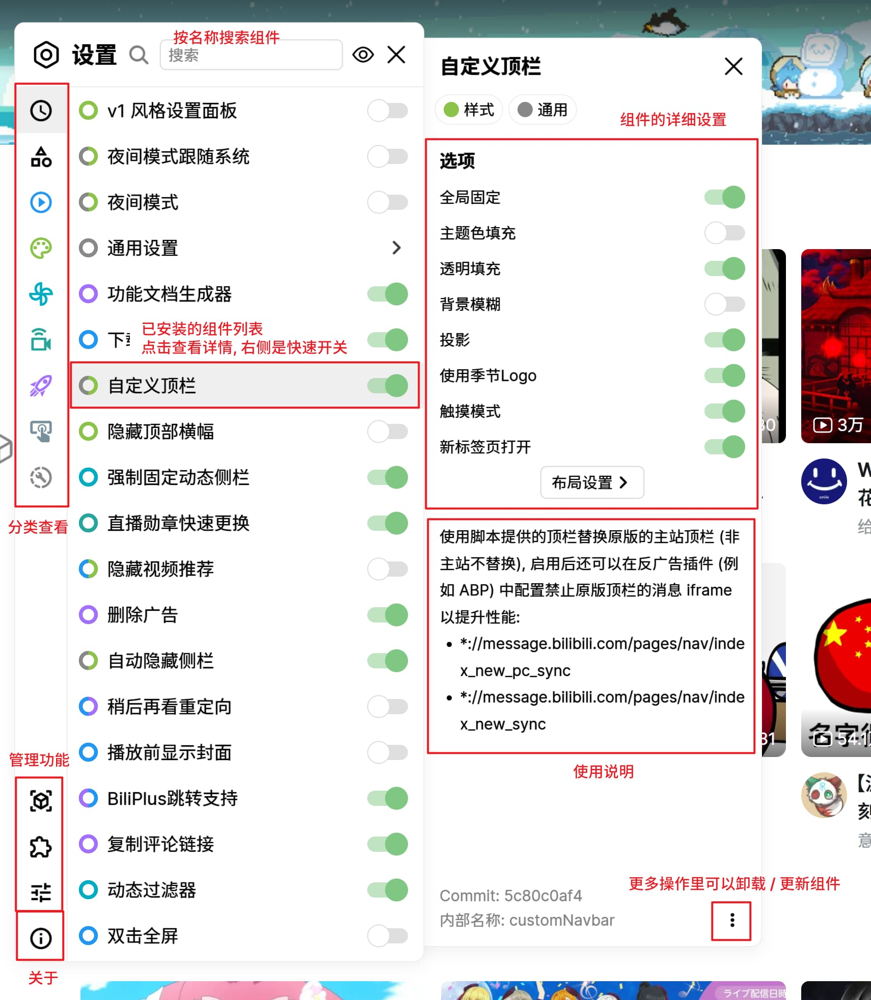
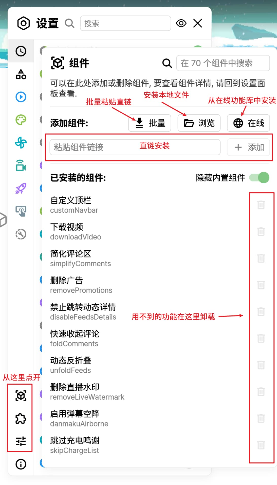
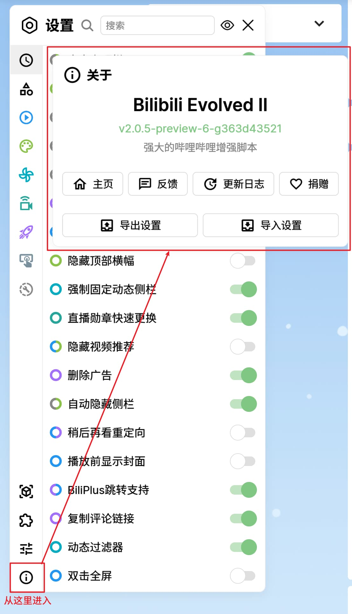

<!-- spell-checker: disable -->

 

「 强大的哔哩哔哩增强脚本 」

[📦 安装](#安装)

[⚙ 设置](#设置)

[📚 功能](doc/features/features.md)

[👻 兼容性](#兼容性)

[🐛 版本历史与更新日志](CHANGELOG.md)

[📌 更新计划](https://github.com/users/the1812/projects/1/views/3)

[📕 文档站点](https://bilibili-evolved-doc.vercel.app/)
> 文档站点由 [Waua](https://github.com/FoundTheWOUT) 开发, [点此进入 GitHub 仓库](https://github.com/FoundTheWOUT/bilibili-evolved-doc).

[📖 参与开发](CONTRIBUTING.md)

[❤ 捐助](doc/donate.md)

# 安装
需要浏览器装有 [Tampermonkey](https://tampermonkey.net/) 或 [Violentmonkey](https://violentmonkey.github.io/) 插件, 下方表格中挑一个链接安装.

**注意事项**
- **⚠ 使用正式版 (GitHub 源) 和预览版须翻墙.**
- 默认不预装任何组件, 需要在按[设置](#设置)中的说明添加感兴趣的功能; 默认会屏蔽双击全屏, 如有需要可以安装 `双击全屏` 组件来恢复.
- 这个是一个综合性的脚本, 如果只是想下载视频建议去 [GreasyFork](https://greasyfork.org/zh-CN/scripts/by-site/bilibili.com) 找个更专业的.
- 对性能有较大影响, 详见[配置要求](#配置).
- 默认不对未登录的状态做适配.
- 新版本一旦正式发布, 就不再对旧版本做任何技术支持.
- 使用外部网站的链接时 (如将下载任务发送到自己的服务器 / 使用链接安装组件等) 可能会提示"脚本试图访问跨域资源", 请选择"始终允许" 避免下次还提示.

| 正式版 (jsDelivr 源)                                                                                     | 正式版 (GitHub 源)                                                                                      | 预览版                                                                                                           |
| -------------------------------------------------------------------------------------------------------- | ------------------------------------------------------------------------------------------------------- | ---------------------------------------------------------------------------------------------------------------- |
| [安装](https://cdn.jsdelivr.net/gh/the1812/Bilibili-Evolved@master-cdn/dist/bilibili-evolved.user.js) | [安装](https://raw.githubusercontent.com/the1812/Bilibili-Evolved/master/dist/bilibili-evolved.user.js) | [安装](https://raw.githubusercontent.com/the1812/Bilibili-Evolved/preview/dist/bilibili-evolved.preview.user.js) |

> 如果处于某种原因只能停在旧版, 可以参考[旧版本回退指南](./doc/rollback.md).

# 设置
脚本启用后, 在网页左侧中央会有功能面板和设置面板的入口. 功能面板中包含适用于当前页面的一些功能入口, 设置面板中可以管理组件的开启/关闭, 修改组件选项, 以及安装/卸载组件和插件等.

全新安装的脚本实际上没有任何功能, 你可以通过多种方式添加功能:

打开设置面板, 进入左下的组件/插件/样式管理, 会有批量, 浏览, 和在线三个按钮, 以及下面还有个输入框可以用链接添加.
- `批量`: 可以粘贴多个功能的在线链接并一次性安装.
- `浏览`: 载入本地的功能文件.
- `在线`: 打开在线仓库窗口.

> 用链接安装需要对应文件的直链, 批量安装时逐行粘贴链接即可.

如果你曾经使用过 v1 版, 可以利用 `v1 设置迁移` 组件将旧设置导入到 v2 中, 该工具将自动把里面开启的设置对应的组件下载并安装, 使用方法可以参考[这个文档](./doc/v1-migrate.md).

最后, 在关于面板中, 可以查看脚本的详细版本号, 以及进行设置导入 / 导出等快捷操作.

# 配置
## 最低配置
- 操作系统: Windows 8.1 / macOS Big Sur
- 分辨率: 1920x1080, 缩放 125%
- 浏览器: Chrome 105+ / Firefox 127+ / Safari 15.4+ (仅理论上能运行, 没测试过)
- 处理器: Intel Core i5-10500 / AMD Ryzen 5 3600
- 内存: 8GB
- 脚本管理器: Tampermonkey 5.0 / Violentmonkey 2.18
- 显卡: GeForce GTX 1050 / Radeon HD 7870
- 网络: 10MB/s

## 推荐配置
- 操作系统: Windows 10 / macOS Sonoma
- 分辨率: 3840x2160, 缩放 200%
- 浏览器: Chrome 120+ / Firefox 127+
- 处理器: Intel Core i7-11700 / AMD Ryzen 7 5800
- 内存: 32GB
- 脚本管理器: Tampermonkey 5.0 / Violentmonkey 2.18
- 显卡: GeForce RTX 3060 / Radeon RX 6600XT
- 网络: 20MB/s

# 兼容性

## 脚本管理器

### [Tampermonkey](https://tampermonkey.net/) / [Violentmonkey](https://violentmonkey.github.io/)
兼容, 但在较旧的浏览器中 Violentmonkey 可能无法运行此脚本.

### [Greasemonkey](https://www.greasespot.net/)
不兼容.

### [AdGuard](https://adguard.com/zh_cn/adguard-windows/overview.html)
不兼容.

## 浏览器

支持**最新版** Chrome, Firefox, 不保证脚本能在 Safari 和 ["套壳类浏览器"](https://www.jianshu.com/p/67d790a8f221) 中完美运行.

# 开发者

## 文案翻译贡献者
- [PleiadeSubaru](https://github.com/Etherrrr)
- [Lets-Halloween](https://github.com/Lets-Halloween)
- Joshuaふみひる

## 参与项目
欢迎参考[代码贡献指南](CONTRIBUTING.md)来为项目添砖加瓦~

## 更换 CDN
如果希望更换脚本的基础 CDN (GitHub Raw), 可以参考[更换脚本 CDN](./doc/cdn.md)中的说明.

# 隐私声明
本脚本以及本仓库中提供的组件/插件, 是完全匿名的. 用户数据的使用均在本地完成, 不会存储到任何服务器, 也不会有所谓的"用户体验改善计划"来收集统计数据.

但是, 任何组件/插件都对用户数据有着完全的访问能力, 对于其他来源(非本仓库提供)的组件/插件, 请自行甄别其安全性.

# 开源许可

见 [LICENCE.md](./LICENCE.md).

# 第三方开源组件
👍感谢这些组件帮助我们极大地提升了开发效率.

- [Vue.js](https://cn.vuejs.org/index.html)
- [JSZip](https://stuk.github.io/jszip/)
- [StreamSaver.js](https://github.com/jimmywarting/StreamSaver.js)
- [bilibili API collect](https://github.com/SocialSisterYi/bilibili-API-collect)
- [popper-core](https://github.com/popperjs/popper-core)
- [Tippy.js](https://github.com/atomiks/tippyjs)
- [Sortable](https://github.com/SortableJS/Sortable)
- [color](https://github.com/Qix-/color)
- [Lodash](https://lodash.com/)
- [marked](https://github.com/markedjs/marked)
- [MDI](https://materialdesignicons.com)

# 相关推荐
这些脚本/插件同样能够改善您在B站的体验, 相同的功能将不会整合到 Bilibili Evolved, 但会尽可能地适配

## BewlyBewly
作者: [Hakadao](https://github.com/hakadao)
- [GitHub](https://github.com/BewlyBewly/BewlyBewly)

## pakku.js 哔哩哔哩弹幕过滤器
作者: [xmcp](https://github.com/xmcp)
- [主页](https://s.xmcp.ml/pakkujs/)
- [GitHub](https://github.com/xmcp/pakku.js)

## BLTH - Bilibili Live Tasks Helper
作者: [andywang425](https://github.com/andywang425)
- [GitHub](https://github.com/andywang425/BLTH)
- [GreasyFork](https://greasyfork.org/zh-CN/scripts/406048-b%E7%AB%99%E7%9B%B4%E6%92%AD%E9%97%B4%E6%8C%82%E6%9C%BA%E5%8A%A9%E6%89%8B)

----

**喜欢的话就点个⭐Star 吧(°∀°)ﾉ**

**或者也可以考虑[捐助](https://github.com/the1812/Bilibili-Evolved/blob/preview/doc/donate.md)支持一下哦(｀・ω・´)**

爱发电

> 之前的支付宝付款码有点问题, 现已弃用 (不必担心, 转账均已收到), 在爱发电中仍然可以选择支付宝作为付款方式.

微信

----

# 我写的其他一些玩意

## [Touhou Tagger](https://github.com/the1812/Touhou-Tagger)
☯ 从 [THBWiki](https://thwiki.cc/) 自动填写东方 Project 同人音乐 CD 曲目信息

## [Malware Patch](https://github.com/the1812/Malware-Patch)
阻止中国流氓软件的管理员授权

## [dizzylab auto theme](https://github.com/the1812/dizzylab-auto-theme)
[dizzylab](https://www.dizzylab.net/) 自适应 Stylus 主题, 跟随系统亮/暗设定

## [Steam CSS](https://github.com/the1812/SteamCSS)
为 [Steam](https://store.steampowered.com/) 的库和内置浏览器插入一段自定义的 CSS, 用于更换字体等

----
