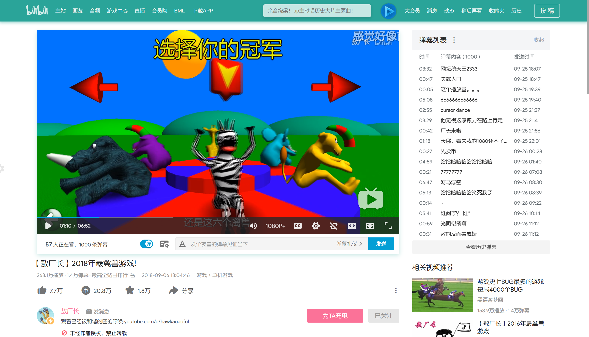
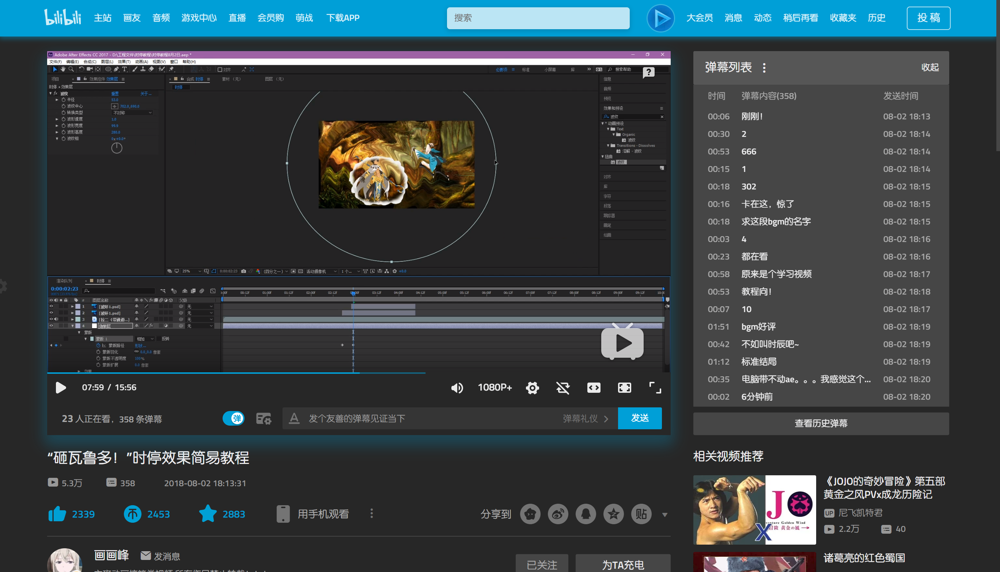
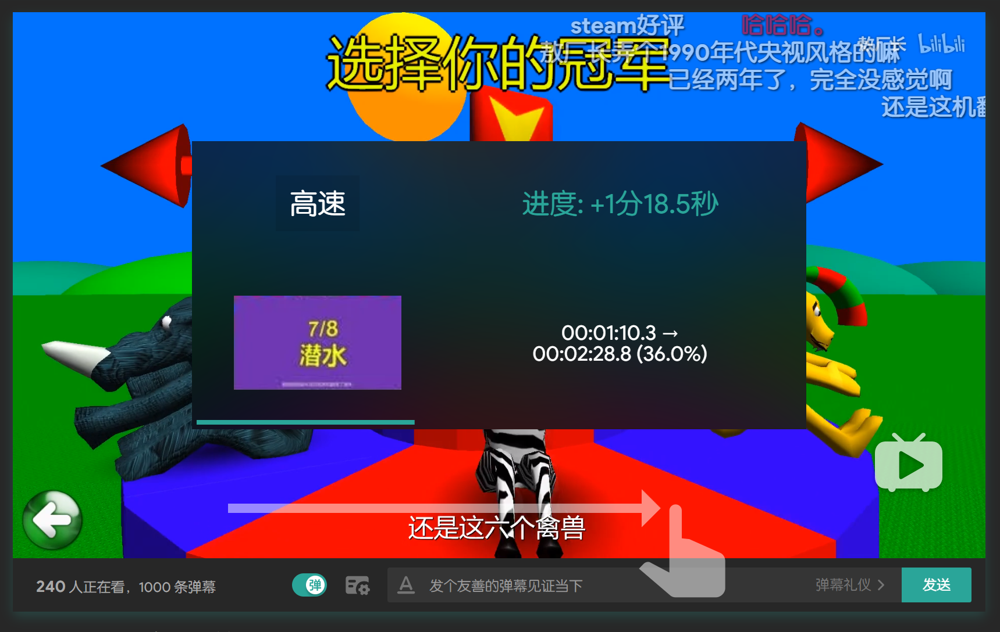
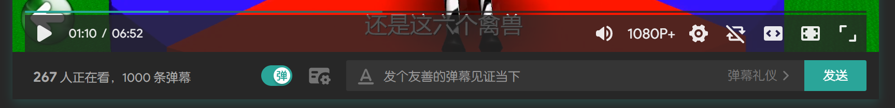
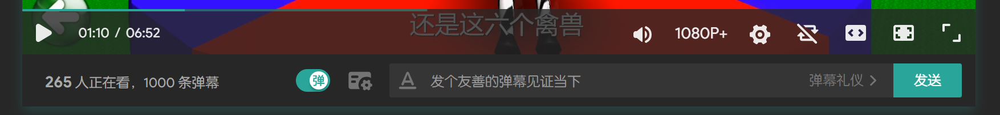

# Bilibili-Evolved
增强哔哩哔哩Web端体验的油猴脚本.

**注: 作为[原脚本](bilibili-touch.user.js)的工程化形式,目前尚未完成,在完成之前可以先使用[原脚本](bilibili-touch.user.js).([安装原脚本](https://github.com/the1812/Bilibili-Evolved/raw/master/bilibili-touch.user.js))**

# 功能概览
## 新样式
改变顶栏的样式,并有一些界面微调,适用于主站和新版播放器.暂不支持直播,相簿.

设备分辨率建议在1080P及以上.
### 效果

### 自定义颜色

### 夜间主题
夜间主题更适合光线暗的环境,并会大量应用自定义颜色.

目前支持的页面有:
- 主站
- 动态
- 新版视频
- 稍后再看
- 观看历史
- 专栏阅读

之后会陆续添加其他页面.
#### 启用前

#### 启用后

### 搜索框位置调整
在主站(非新版播放器)中,总是把搜索框置于顶栏.
#### 启用前

#### 启用后

### 移除横幅
在搜索框位置调整启用的时候,还可以使用此功能移除顶部横幅.
#### 启用前

#### 启用后

## 触摸支持
### 顶栏
删除顶栏右侧的一级链接(从`大会员`到`历史`),以方便触屏设备快速预览信息.被删除的链接可从各预览中的`查看更多`进入.
### 播放器
#### 启用触摸控制
- 左右滑动可调整进度
- 上下滑动可调整音量
- 进度调整可在左上角和右上角取消
- 在不同位置滑动,可以使用3档不同的灵敏度.

已知问题: 滑动调整的音量不会保存,下次打开视频将恢复原音量.
#### 外置网页全屏
因为触屏设备很难做出"鼠标悬停",`网页全屏`将从`全屏`的鼠标悬停菜单中移动到外部.
#### 放大按钮
放大控制栏的按钮及间距,使触摸操作更准确.
##### 启用前

##### 启用后

## 自动展开弹幕列表
新版播放页面中,弹幕列表默认收起以显示推荐的其他视频.启用此功能可在每次加载视频时自动展开弹幕列表.
## 删除广告
删除嵌于页面中的推广横幅.
### 删除前

### 删除后

## 稍后再看重定向
将稍后再看的链接重定向为普通播放网址,以使用新版播放页面.
# 安装
- [正式版](https://github.com/the1812/Bilibili-Evolved/raw/master/bilibili-evolved.user.js)
- [预览版](https://github.com/the1812/Bilibili-Evolved/raw/preview/bilibili-evolved.preview.user.js)
