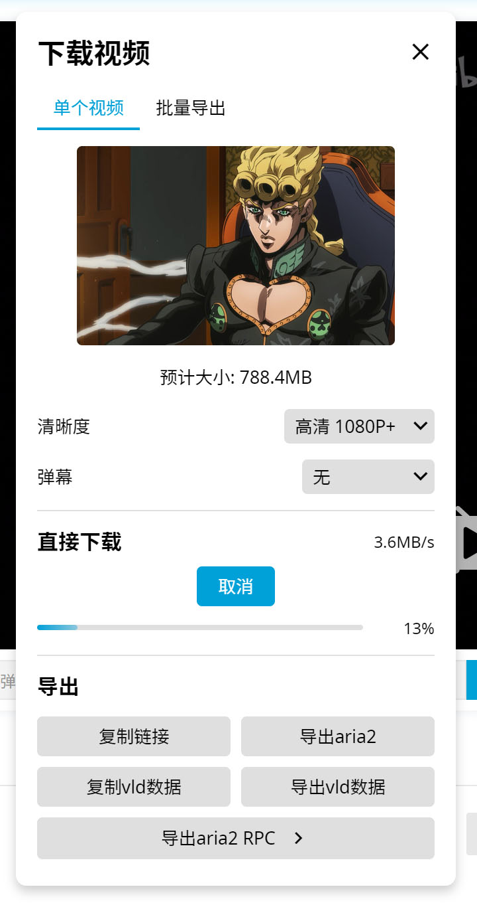
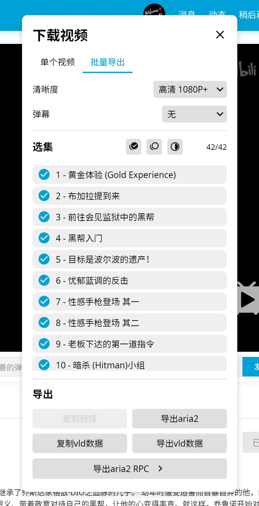
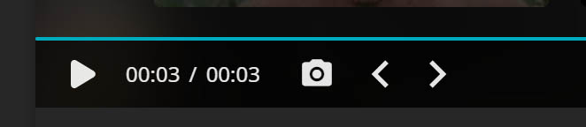
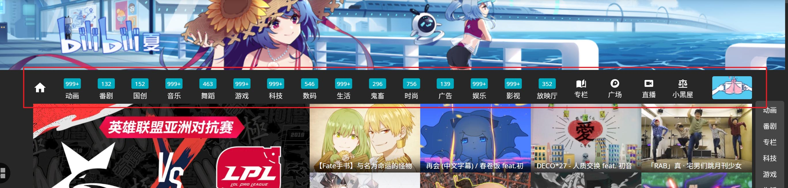
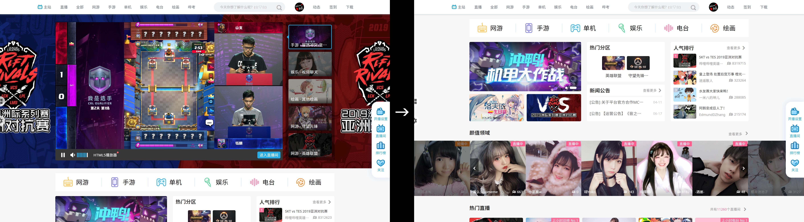
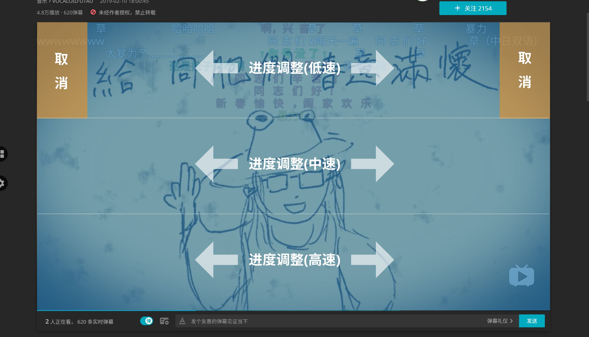
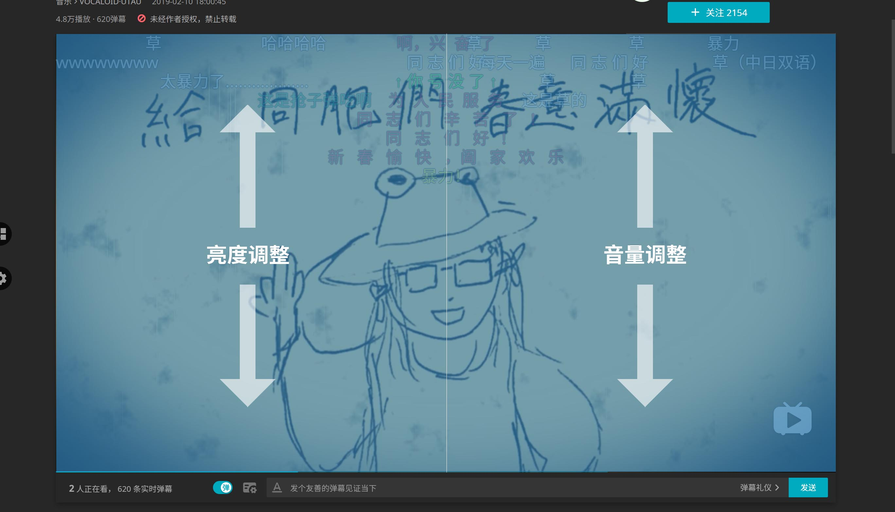

 

「 强大的哔哩哔哩增强脚本 」

[📦 安装](#安装) / [Install](install-tutorial.en-US.md) / [インストール](install-tutorial.ja-JP.md)

[⚙ 设置](#设置)

[📚 功能](#功能)

[👻 兼容性](#兼容性)

[🐛 版本历史与更新日志](https://github.com/the1812/Bilibili-Evolved/releases)

[📖 相关文档](https://github.com/the1812/Bilibili-Evolved/wiki)

[❤ 投喂](donate.md)

# 安装
需要浏览器拥有[Tampermonkey](https://tampermonkey.net/)插件.

点击名称即可安装👇 (点了之后需要一点时间下载)

| [正式版](https://github.com/the1812/Bilibili-Evolved/raw/master/bilibili-evolved.user.js) | [预览版](https://github.com/the1812/Bilibili-Evolved/raw/preview/bilibili-evolved.preview.user.js) | [离线版](https://github.com/the1812/Bilibili-Evolved/raw/master/bilibili-evolved.offline.user.js) | [预览离线版](https://github.com/the1812/Bilibili-Evolved/raw/preview/bilibili-evolved.preview-offline.user.js) |
| ----------------------------------------------------------------------------------------- | -------------------------------------------------------------------------------------------------- | ------------------------------------------------------------------------------------------------- | -------------------------------------------------------------------------------------------------------------- |
| 正式发布的版本, 最稳定, 更新频率较低.                                                     | 新增内容测试的地方, 更新频率高, 但功能不稳定.                                                      | 内置所有依赖项, 体积较大, 更新频率高于正式版.                                                     | 兼备预览版和离线版的特点.                                                                                      |

> **非离线版安装后运行可能会提示"脚本试图访问跨域资源", 请选择"始终允许".**

> 某些破坏性的大更新会使旧版脚本**完全**无法工作, 请及时检查更新.

# 设置
脚本启用后, 在网页左侧中央会有一个齿轮图标, 点击即可打开设置. 默认只启用了一部分功能, 您可以根据需要自由调整设置.

设置项的说明见[功能](#功能)一节, 在网页中通过鼠标停留在某一项也可以查看简要说明.

**绝大部分设置保存后, 需要刷新网页才能生效. 仅有一些样式设置可以立即生效.**

# 功能
大部分功能可通过设置面板开启, 有一些功能会以`附加功能`的形式生效, 或者是可以在`附加功能`做进一步设置. `附加功能`可从网页左侧中央的功能按钮进入.

以下是功能列表, 可以点击某一项功能展开详细说明.

<h2 align="center">视频</h2>

各种视频相关功能

<strong>下载视频</strong>

在视频播放页面中, `下载视频`按钮将在`附加功能`中启用, 点击可以选择清晰度并下载.

### 注意事项
- 请尊重视频原作者的版权.
- 下载后的格式通常为`.flv`, 若需要`.mp4`格式则要手动用其他软件转换, 例如 [ffmpeg](https://ffmpeg.org/) 或 [Handbrake](http://handbrake.fr/).
- **分段**的视频会把所有视频打包成`.zip`格式.
- 能够下载的清晰度取决于当前登录的账号, 例如`高清 1080P60`需要已登录大会员账号.
- 如果以您的账号权限无法观看某些视频(地区限制, 大会员专享等), 就算使用了类似[解除B站区域限制](https://greasyfork.org/zh-CN/scripts/25718-%E8%A7%A3%E9%99%A4b%E7%AB%99%E5%8C%BA%E5%9F%9F%E9%99%90%E5%88%B6)的脚本也是无法下载的. ~~除非您有对应节点的梯子~~
- 直接下载过程中所有数据都存在内存里, 内存占用很大的话会导致系统卡顿. 可以考虑[导出 aria2](aria2-notice.md)来进行下载.

<!-- - 使用`复制链接`得到的链接并不是直接就能用的, 因为**下载时的请求Header必须包含`Referer=https://www.bilibili.com`和正确的`User-Agent`**, 直接粘贴在浏览器里是打不开的. [详细信息](https://github.com/the1812/Bilibili-Evolved/wiki/使用下载视频的复制链接) -->

<strong>下载弹幕</strong>

在视频播放页面中, `下载弹幕`按钮将在`附加功能`中启用, 点击可以下载XML格式的弹幕.
> 点击时若按住`Shift`将下载ASS格式的弹幕, 此功能尚未完善, 完善后会跟XML的操作方式互换.

<strong>查看封面</strong>

在视频播放页面/直播间中, `查看封面`按钮将在`附加功能`中启用, 点击可以查看或保存封面. (其实还可以看专栏的封面, 不过专栏的封面本来就显示在标题上方了)

<strong>指定播放器布局</strong>

设置默认的播放器布局, 可分别设置视频区和番剧区. 尽量在相应的页面里设置(比如在番剧播放页面设置番剧播放器布局), 否则可能没有效果.

> **⚠ 旧版布局中, 很多脚本功能将不适用.**

- 旧版: 传统布局
- 新版: 视频区默认的新版布局

<strong>默认播放器模式</strong>

设置默认的播放器模式, 可以为`常规`, `宽屏`, `网页全屏`或`全屏`. 可以选择在进入页面的首次播放时应用, 或者一进入页面就应用. 还可以设置是否自动关灯.

> ⚠ 自动全屏的效果并不稳定, 可以尝试改用播放时全屏并关闭自动播放.

<strong>默认视频画质</strong>

进入视频时自动选择指定的画质, 若视频最高画质低于所选画质, 则使用视频的最高画质.

> 官方于2018.12.27已正式支持记忆画质

<strong>默认视频速度</strong>

进入视频时自动选择指定的视频倍速.

<strong>默认弹幕设置</strong>

设置默认是否开启弹幕, 以及是否记住防挡字幕和智能防挡弹幕.

<strong>自动展开弹幕列表</strong>

新版播放页面中, 弹幕列表默认收起以显示推荐的其他视频. 启用此功能可在每次加载视频时自动展开弹幕列表.

<strong>自动展开视频简介</strong>

长的视频简介默认会被折叠, 启用此功能可以强制展开完整的视频简介.

<strong>自动从历史记录点播放</strong>

播放视频时如果检测到历史记录信息(`上次看到...`消息), 则自动跳转到相应的时间播放.
> 如果还开启了`允许跨集跳转`, 即使当前集数跟历史记录不同也会跳转.

<strong>自动播放视频</strong>

进入视频页面时自动开始播放视频.

<strong>跳过充电鸣谢</strong>

自动跳过视频结尾处的充电鸣谢.

<strong>启用逐帧调整</strong>

在播放器的时间右边增加两个按钮, 用于**较**精细调整视频时间. 支持键盘快捷键`Shift + 左/右方向键`. (旧版播放器只能用键盘快捷键, 不会显示按钮)

注: `视频的实际播放帧率`跟`视频本身的帧率`和`显示器的刷新率`有关, 很难计算一个精准的数值, 部分视频仍然会有暂停不到那种一闪而过的图的情况.

逐帧调整的精确度固定为:
- `1080P60`/`720P60`: 1001 / 60000 秒 (59.94006 fps)
- `其他清晰度`: 1001 / 30000 秒 (29.97003 fps)

<strong>启用视频截图</strong>

在播放器的时间右边增加截图按钮, 点击可以截取视频画面, 不会包含暂停标志和弹幕. 截取的图片将在网页右侧显示(非全屏或网页全屏模式), 可以单独保存或丢弃, 也可以截取一定数量后一次性保存. 支持键盘快捷键`Ctrl + Alt + C`. (旧版播放器只能用键盘快捷键, 不会显示按钮)

如果弹幕渲染类型选择了Canvas, 则可以再按住`Shift`键来截取带弹幕的截图. 也就是鼠标操作为"按住`Shift`点击截图按钮", 键盘操作为"`Ctrl + Shift + Alt + C`".

<strong>自动定位到播放器</strong>

进入视频/番剧页面时, 自动定位到播放器.

<strong>外置稍后再看</strong>

将视频页面菜单里的`稍后再看`移到外面.

<strong>快捷键扩展</strong>

为视频播放器启用更多的快捷键:
- `w` 网页全屏
- `t` 宽屏
- `r` 循环播放
- `m` 静音
- `d` 弹幕开关
- `l` 点赞
- `c` 投币
- `s` 收藏
- `Shift + ↑/↓` / `Shift + ,/.` 播放速度调整
- `Shift + /` 重置播放速度

附: b站原生快捷键列表:
- `f` 全屏/退出全屏
- `space` 播放/暂停
- `→` 步进5s
- `←` 步退5s
- `↑` 音量增加10%
- `↓` 音量降低10%
- `媒体键 play/pause` 播放/暂停
- `esc` 退出全屏
- `[` 多P 上一个
- `]` 多P 下一个
- `enter` 发弹幕

> ⚠ 此功能与原生快捷键有一点差异: 在网页任何地方点下快捷键都会生效, 除非正在打字. (原生快捷键需要聚焦到播放器才能用)

<strong>双击全屏</strong>

允许双击播放器切换全屏, 请注意不能与`播放器触摸支持-启用双击控制`一同使用.

<h2 align="center">样式</h2>

掌控哔哩哔哩的外观

<strong>主题颜色</strong>

设定顶栏和夜间模式使用的主题色, 可以点击颜色预览的圆圈打开色板, 其中含有预定义的16种主题色, 也可以在右侧的文本框直接输入任何有效的16进制颜色值(`#rrggbb`或`#rgb`).

<strong>自定义顶栏</strong>

启用自定义顶栏, 替代原版的顶栏, 仅对主站生效, 直播/相簿/会员购等仍使用原来的顶栏.

可用的选项包括:
- 使用季节Logo
- 使用主题色填充顶栏
- 为顶栏添加一层阴影效果
- 为顶栏使用更紧凑的布局, 紧凑布局将使用更小的间距, 以及在视频标题过长时用...省略后面的部分
- 在顶部横幅存在时, 使用背景模糊效果
- 设定背景模糊效果的不透明度
- 改变顶栏边缘两侧的间距
- 改变顶栏里栏目的顺序和显示状态

前6个是整体的外观设置, 可以在设置里直接开关, 后面2个是对顶栏里面内容的详细布局设定, 可以在`附加功能`里设置.

下图展示了顶栏在不同设置下的整体外观: (从上到下依次为: 不使用主题色填充, 不填充+夜间模式, 填充主题色, 使用不同的主题色)

顶栏内容的布局也可以自定义, 可以通过此功能移除顶栏里不需要的组件, 或排列它们的顺序:

<strong>夜间模式</strong>

夜间模式更适合光线暗的环境, 并会大量应用主题颜色.

目前仅支持部分常用页面, 其他页面会陆续添加, 不支持推广板块(会被`删除广告`功能去除的部分).

**启用前**

**启用后**

<strong>夜间模式计划时段</strong>

设置一个使用夜间模式的时间段, 进入/离开此时间段时, 会自动开启/关闭夜间模式.
> 结束时间小于起始时间时将视为次日, 如`18:00`至`6:00`表示晚上18:00到次日6:00.

<strong>首页使用紧凑布局</strong>

设置首页是否使用紧凑布局, 视频的间距会减小, 番剧的图片和排名序号会变成圆形, 分区栏的图标会使用高清重制版.

**启用前**

**启用后**

<strong>简化评论区</strong>

- 删除热评头像下方的关注按钮
- 删除用户的等级标识
- 删除发送源信息(`来自安卓客户端`这种)
- 删除用户名右边的勋章
- 删除评论区顶部的横幅
- 发送时间移动到右上角
- 位图图标全部换用矢量图标, 高分屏不会模糊
- 投票仅显示链接, 隐藏下面的大框.

> 关注和等级可以通过鼠标停留在头像上, 在弹出的资料卡小窗中查看

<strong>简化直播间</strong>

- 隐藏姥爷图标
- 隐藏粉丝勋章
- 隐藏活动头衔
- 隐藏用户等级
- 隐藏舰长图标
- 隐藏全区广播
- 隐藏欢迎信息 (xxx姥爷进入直播间)
- 隐藏礼物弹幕 (仅弹幕列表, 特殊效果如节奏风暴不受影响)
- 隐藏上舰提示 (弹幕列表里的 xxx开通了舰长)
- 隐藏付费礼物 (播放器下面的各种金瓜子礼物, 以及许愿瓶, 上舰等)
- 隐藏活动横幅
- 隐藏抽奖提示 (开通舰长, 小飞船抽奖等)
- 禁用直播间皮肤

每一项都可以在`附加功能`中单独选择是否隐藏. 图片中展示的是全部隐藏时的效果对比.

<strong>隐藏顶部横幅</strong>

隐藏主站顶部的横幅, 注意这会导致搜索框也被隐藏, 除非开启了自定义顶栏.

<strong>播放器投影</strong>

为播放器添加主题色投影.

<strong>强制保留弹幕发送栏</strong>

在网页全屏时, 即使宽度过小也强制保留弹幕发送栏, 注意这可能导致右侧的功能按钮挤出边界.

<!-- 

<strong>模糊视频控制栏背景</strong>

模糊视频控制栏背景, 原有的阴影效果将无效.
此功能需要浏览器支持背景模糊效果, 详情见[背景模糊兼容性](backdrop-filter.md)一节.
**启用前**

**启用后**

 -->

<strong>控制栏着色</strong>

给视频控制栏附上半透明的黑色, 代替原来的阴影, 黑色的不透明度可在设置中调整.

**启用前**

**启用后**

<strong>缩放直播看板娘</strong>

根据屏幕DPI缩放直播看板娘的大小以提高像素的清晰度, DPI缩放为100%的用户不需要此功能.

<strong>删除直播水印</strong>

删除观看直播时角落的水印.

<strong>删除视频标题层</strong>

删除视频里鼠标经过时出现在右上角的标题层.

<strong>隐藏返回旧版</strong>

隐藏播放页右侧的`返回旧版`入口.

<strong>隐藏番剧点评</strong>

隐藏番剧播放页面的点评板块, 不会隐藏番剧介绍页那里的点评.

<strong>隐藏分区栏</strong>

隐藏主站的分区栏, 分区仍然可以从顶栏的主站菜单中进入.

<h2 align="center">动态</h2>

改善动态体验

<strong>解除动态存图限制</strong>

右键点击动态大图时, 如果这张图的右键菜单被禁止了, 将弹出带图片的消息方便保存.

<strong>快速收起动态评论区</strong>

动态里查看评论区时, 在底部添加一个`收起评论`按钮, 这样就不用再回到上面收起了.

<strong>展开动态标题</strong>

在顶栏的动态预览框中, 不管名称多长, 总是完全展开视频的标题.

<strong>展开动态内容</strong>

不管内容多长, 总是完全展开动态的内容.

<strong>旧版动态跳转支持</strong>

将新版动态的链接换为旧版动态, 同时可在附加功能中在新旧动态间切换.

<h2 align="center">工具</h2>

各式各样的小玩意

<strong>删除广告</strong>

删除站内的各种广告. 包括首页的推广模块, 手机app推荐, 视频页面右侧的广告等.

<strong>稍后再看重定向</strong>

将稍后再看的链接重定向为普通播放网址, 以使用新版播放页面.

<strong>隐藏搜索推荐</strong>

将搜索框的推荐词替换为`搜索`.

<strong>展开选集标题</strong>

在视频选集列表中, 当标题超出一行时, 另起一行以显示完整标题.
> 因为番剧选集用的绝对布局, 所以此功能在番剧区无效.

<strong>直播间勋章快速切换</strong>

在直播区(live.bilibili.com)中, 可从`附加功能`中直接切换勋章和头衔.

<strong>显示失效视频信息</strong>

在个人空间中, 为已失效视频恢复标题和封面. 如果还启用了`失效视频重定向`, 还会把视频的链接替换为BiliPlus里对应的页面.

`信息来源`默认为`稍后再看`, 脚本将把视频添加到稍后再看, 拿到标题和封面后再从稍后再看删掉, 会消耗一定时间. 之后如果 BiliPlus API 弄好了, 将开放`BiliPlus`的选项, 速度相对更快.

<strong>BiliPlus跳转支持</strong>

在视频/番剧/空间中, 附加功能`转到BiliPlus`, 点击可以转到[BiliPlus](https://biliplus.com)上对应的页面.

<strong>下载音频</strong>

在音频区中, 附加功能会出现`下载音频`按钮, 当你进入某一音乐的详细信息页面时, 点击按钮可以下载该页面对应的音乐. 在其他页面中此按钮将不可点击.

> 正在播放的音乐点击封面即可转到详细信息页面.

<strong>高分辨率图片</strong>

根据屏幕DPI请求更高分辨率的图片, 例如DPI缩放200%则请求2倍的分辨率, 加载时间也会相应变长一些.
适用于2K, 4K等的显示屏, DPI缩放为100%的用户不需要此功能.

<strong>界面翻译(实验性)</strong>

为界面中一些常用文本提供翻译, 完成度不高, 目前仅开放日语和英语.

> 如果希望贡献翻译, 请参阅[翻译指南](https://github.com/the1812/Bilibili-Evolved/blob/preview/src/utils/i18n/i18n.md). 在文件中添加翻译文本后即可发送 Pull Request (到 preview 分支), 不需要编译. ~~因为本项目的开发环境弄得很烂, 请不要把时间和精力浪费在搭建开发环境上.~~

<strong>禁止直播首页自动播放</strong>

禁止直播首页的推荐直播间自动开始播放, 开启后, 还可以通过`隐藏首页推荐直播`直接隐藏掉这个推荐板块.

<strong>瓜子换硬币</strong>

在附加功能中添加`瓜子换硬币`的按钮, 点击可以将700银瓜子换成1个硬币, 每天限1次.

<strong>直播间自动领奖</strong>

在当前直播间有抽奖活动时, 自动点击抽奖按钮. 注意只适用于少量抽奖, 那种99+限量抽奖可能跟不上其他人的手速.

<strong>专栏文字选择</strong>

使专栏的文字可以选择.

<strong>稍后再看期限提醒</strong>

稍后再看里的视频添加后60天会过期自动删除. 开启此功能可在期限不足14天时在稍后再看列表里显示过期警告.

<h2 align="center">触摸</h2>

为支持触屏的设备特别设计的功能

<strong>顶栏触摸优化</strong>

删除顶栏右侧的一级链接(从`大会员`到`历史`), 以方便触屏设备快速预览信息. 被删除的链接可从各预览中的`查看更多`进入.

<strong>素质三连触摸支持</strong>

为素质三连(长按点赞)启用触摸支持.

<strong>播放器触摸支持</strong>

- 增大控制栏的按钮间距, 使触摸操作更准确.

- 启用触摸手势
    - 左右滑动可调整进度, 上下位置不同灵敏度不同
    - 进度调整可在左上角和右上角取消
    - 左侧上下滑动可调整亮度
    - 右侧上下滑动可调整音量

<strong>启用双击控制</strong>

将操作方式更改为: 单击显示/隐藏控制栏, 双击播放/暂停.

<h2 align="center">其他</h2>

关于脚本自身的一些设定

<strong>显示消息</strong>

允许在网页左下角显示来自本脚本的消息, 如更新提醒, 错误提示等.

<strong>显示内部错误消息</strong>

开启后, 错误消息将显示详细的技术性错误信息及堆栈跟踪, 这通常用于准确地确定问题发生的原因, 所以报告问题时这些信息会非常有用.

<!-- 

<strong>启用缓存</strong>

使用缓存以提高脚本的加载速度, 此选项只对非离线版有效, 可在`附加功能`中清除脚本的缓存.

 -->

<strong>文件命名格式</strong>

自定义文件命名格式, 作用于`下载弹幕`, `下载视频`, `视频截图`, `查看封面`.
可以使用的变量有:
- `title`: 视频标题/直播间标题
- `ep`: 选集标题
- `aid`: AV号
- `cid`: CID (每个视频的唯一编号, AV号对应的视频可能有多集)
- `lid`: 直播间号
- `y`/`M`/`d`: 年/月/日
- `h`/`m`/`s`/`ms`: 时/分/秒/毫秒

默认的格式是`[title][ - ep]`, 标题+选集标题, 当没有选集标题时则只有标题.

变量要放在方括号里, 而方括号里的其他内容会在变量有效时出现. 比如格式如果写成`[title] - [ep]`, 那么即使没有选集标题, 中间那个` - `也会出现在文件名里. 如果像默认那样放在方括号里, 没有选集标题时, ` - `也不会出现.

例如, 想要标题+AV号+时间的格式, 可以设定为`[title][ AVaid] [y]-[M]-[d] [h]-[m]-[s]`, 能够得到类似`xxxx AV23333 2019-05-29 19-59-44`的名字.

<strong>侧栏垂直偏移量</strong>

设定侧栏的垂直偏移量, 单位为百分比, 允许的范围为 -40% ~ 40%.

<strong>Ajax Hook API</strong>

是否启用 Ajax Hook API, 其他插件或附加功能能够通过此 API 获取 Ajax 请求的信息.

<strong>加载模式</strong>

脚本功能的加载模式:
- 同时: 与b站页面同时加载
- 延后: 优先加载b站页面, 在b站页面加载完成后再开始加载脚本功能
- 同时(自动): 根据页面自动选择加载模式, 默认采用同时模式
- 延后(自动): 根据页面自动选择加载模式, 默认采用延后模式

# 兼容性
## 脚本管理器
### [Tampermonkey](https://tampermonkey.net/) / [Violentmonkey](https://violentmonkey.github.io/)
完全兼容.
### [Greasemonkey](https://www.greasespot.net/)
不支持, 请使用以上的两种管理器.

## 浏览器

支持 Chrome, Edge (Chromium 内核), Firefox, Safari, 不保证脚本能在["套壳类浏览器"](https://www.jianshu.com/p/67d790a8f221)中完美运行.

UWP 版 Edge 已经不再支持了(就是 Windows 10 自带的那个), 请使用以上列出的浏览器, 或换用 [Chromium 内核的 Edge](https://microsoftedgeinsider.com/).

另外, Chromium 内核的 Edge 可以通过特殊手段启用中文界面, 网上搜一下就有, 或者也可以参考这篇 [Gist](https://gist.github.com/the1812/bd5c3edabd61b03696428fcfde53d74f). (需要梯子)

# 关于源码
虽然本项目的源代码是公开的, 但是我并不推荐您花太多时间阅读这些代码. 因为这是我的第一个JavaScript项目, 它包含了从我初学JavaScript到如今形成一定风格以来写下的各种代码(各种祖传代码), 不同的几个模块可能风格差异会很大, 像是早期DOM操作经常使用jQuery到后期完全转向原生API, 4空格缩进变成2空格缩进等等. 一些比较复杂的模块里也是放飞自我.

所以, 如果您希望通过阅读源码来学习知识的话, 建议去看看那些更专业更成熟的项目.

------

**喜欢的话就点个⭐Star吧(°∀°)ﾉ**
