# Bilibili Evolved
增强哔哩哔哩Web端体验: 下载视频, 封面, 弹幕; 自定义播放器的画质, 模式, 布局; 删除广告, 使用夜间模式, 修复界面瑕疵; 以及增加对触屏设备的支持等.

- [安装](#安装)
- [了解所有功能](#功能)
- [浏览设置项](#设置)
- [兼容性](#兼容性)
- [版本历史与更新日志](https://github.com/the1812/Bilibili-Evolved/releases)
- [捐赠入口](donate.md)
- [🕊](https://github.com/the1812/Bilibili-Evolved/wiki/Coming-Features)

# 安装
需要浏览器拥有[Tampermonkey](https://tampermonkey.net/)插件.

点击名称即可安装👇

| [正式版](https://github.com/the1812/Bilibili-Evolved/raw/master/bilibili-evolved.user.js) | [预览版](https://github.com/the1812/Bilibili-Evolved/raw/preview/bilibili-evolved.preview.user.js) | [离线版](https://github.com/the1812/Bilibili-Evolved/raw/master/bilibili-evolved.offline.user.js) | [预览离线版](https://github.com/the1812/Bilibili-Evolved/raw/preview/bilibili-evolved.preview-offline.user.js)
| ----- | ----- | ----- | -----
| 正式发布的版本, 最稳定, 更新频率较低. | 新增内容测试的地方, 更新频率高, 但功能不稳定. | 内置所有依赖项, 体积较大, 更新频率高于正式版. | 兼备预览版和离线版的特点.

> 某些破坏性的大更新会使旧版脚本**完全**无法工作, 请及时检查更新.
# 设置
脚本启用后, 在网页左侧中央会有一个齿轮图标, 点击即可打开设置.
设置项的说明见[功能](#功能)一节.

**设置保存后, 需要刷新网页才能生效.**
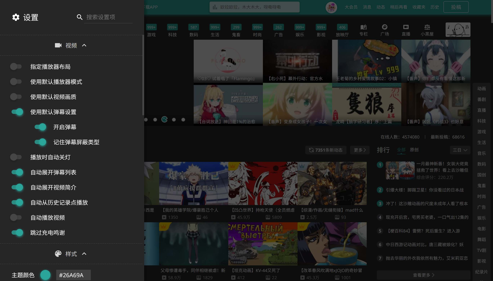
## 默认值
### 视频
- 指定播放器布局: `关闭`
    - 视频区布局: `新版`
    - 番剧区布局: `旧版`
- 使用默认播放器模式: `关闭`
    - 默认播放器模式: `常规`
    - 播放时应用模式: `开启`
- 使用默认视频画质: `关闭`
    - 画质设定: `自动`
- 使用默认弹幕设置: `关闭`
    - 开启弹幕: `开启`
    - 记住弹幕屏蔽类型: `关闭`
- 播放时自动关灯: `关闭`
- 自动展开弹幕列表: `开启`
- 自动展开视频简介: `开启`
- 自动从历史记录点播放: `关闭`
- 自动播放视频: `关闭`
- 跳过充电鸣谢: `关闭`
### 样式
- 主题颜色: `浅蓝色(#00A0D8)`
- 样式调整: `开启`
    - 顶栏(对横幅)透明度: `0.382`
- 夜间模式: `关闭`
- 夜间模式计划时段: `关闭`
    - 起始时间: `18:00`
    - 结束时间: `6:00`
- 首页紧凑布局: `关闭`
- 简化评论区: `开启`
- 搜索栏置顶: `开启`
    - 显示顶部横幅: `开启`
    - 显示排行榜图标: `开启`
- 模糊视频控制栏背景: `关闭`
- 控制栏着色: `开启`
    - 不透明度: `0.64`
- 缩放直播看板娘: `开启`
- 删除直播水印: `开启`
- 删除视频标题层: `关闭`
### 工具
- 删除广告: `开启`
- 稍后再看重定向: `开启`
- 隐藏搜索推荐: `关闭`
- 展开动态标题: `开启`
- 展开选集标题: `关闭`
- 显示失效视频信息: `关闭`
    - 失效视频重定向: `关闭`
### 触摸
- 顶栏触摸优化: `关闭`
- 素质三连触摸支持: `关闭`
- 播放器触摸支持: `关闭`
    - 启用实验性动画效果: `关闭`
    - 启用双击控制: `关闭`
### 其他
- 显示消息: `开启`
    - 显示内部错误消息: `关闭`
- 启用缓存: `开启`

# 功能
大部分功能可通过设置面板开启, 有一些功能会以`附加功能`的形式生效, `附加功能`可从网页左侧中央的功能按钮进入.
> 为保证最佳体验, 设备分辨率建议在1080P及以上, 并且已登录哔哩哔哩账户.

## 视频
### 下载视频
在视频播放页面中, `下载视频`按钮将在`附加功能`中启用, 点击可以选择清晰度并下载.

#### 注意事项
- 下载后的格式通常为`.flv`, 若需要`.mp4`格式则要手动用其他软件转换.
- **分段**的视频会把所有视频打包成`.zip`格式.
- 能够下载的清晰度取决于当前登录的账号, 例如`高清 1080P60`需要已登录大会员账号.
- 下载过程中所有数据都存在内存里, 内存占用很大的话会导致系统卡顿. 如果你更喜欢使用其他的下载软件, 可以使用`复制链接`选项. **下载时的请求Header必须包含`Origin=https://www.bilibili.com`和`Referer=当前视频网址`**
- Chrome浏览器对单个文件大小有[限制](https://chromium.googlesource.com/chromium/src/+/master/storage/browser/blob/README.md#example-limits), 如果在下载完成时浏览器发生崩溃, 请尝试适当降低画质.
    - 64位限制: 2GB
    - 32位限制: 614MB

### 下载弹幕
在视频播放页面中, `下载弹幕`按钮将在`附加功能`中启用, 点击可以下载XML格式的弹幕.
> 点击时若按住`Shift`将下载ASS格式的弹幕, 此功能尚未完善, 完善后会跟XML的操作方式互换.

### 查看封面
在视频播放页面/直播间中, `查看封面`按钮将在`附加功能`中启用, 点击可以查看或保存封面. (其实还可以看专栏的封面, 不过专栏的封面本来就显示在标题上方了)

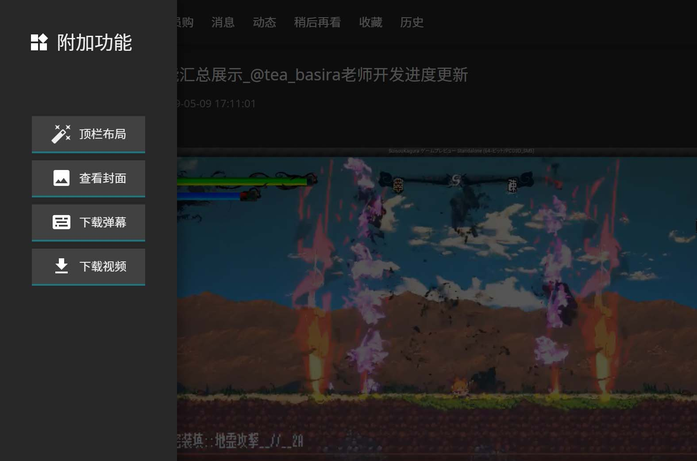

### 指定播放器布局
设置默认的播放器布局, 可分别设置视频区和番剧区. 尽量在相应的页面里设置(比如在番剧播放页面设置番剧播放器布局), 否则可能没有效果.

> **⚠ 旧版布局中, 很多脚本功能将不适用.**

- 旧版: 传统布局
- 新版: 视频区默认的新版布局

### 默认播放器模式
设置默认的播放器模式, 可以为`常规`, `宽屏`或`网页全屏`(`全屏`还未完成). 可以选择在进入页面的首次播放时应用, 或者一进入页面就应用.
### 默认视频画质
进入视频时自动选择指定的画质, 若视频最高画质低于所选画质, 则使用视频的最高画质.

> 官方于2018.12.27已正式支持记忆画质
### 默认弹幕设置
设置默认是否开启弹幕, 以及是否记住防挡字幕和智能防挡弹幕.
### 播放时自动关灯
首次播放时, 自动进入关灯模式.
### 自动展开弹幕列表
新版播放页面中, 弹幕列表默认收起以显示推荐的其他视频. 启用此功能可在每次加载视频时自动展开弹幕列表.
### 自动展开视频简介
长的视频简介默认会被折叠, 启用此功能可以强制展开完整的视频简介.
### 自动从历史记录点播放
播放视频时如果检测到历史记录信息(`上次看到...`消息), 则自动跳转到相应的时间播放.
### 自动播放视频
进入视频页面时自动开始播放视频.
### 跳过充电鸣谢
自动跳过视频结尾处的充电鸣谢.

## 样式
### 主题颜色
设定顶栏(样式调整启用时)和夜间模式使用的主题色, 可以点击颜色预览的圆圈打开色板, 其中含有预定义的16种主题色, 也可以在右侧的文本框直接输入任何有效的16进制颜色值(`#rrggbb`或`#rgb`).
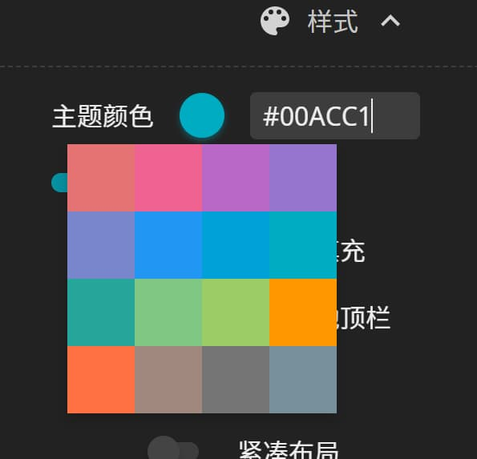

### 样式调整
**主要**会改变顶栏的样式, 并有一些其他地方的界面微调:
- 为播放器增加主题色投影
- 可控制顶栏对横幅的透明度
- 使播放器按钮垂直对齐
- 使部分搜索栏的提示文字的颜色更清晰
- 隐藏播放页面的"返回旧版"侧栏
- 修复直播间一些文字初始状态不正确
#### 顶栏效果

### 夜间模式
夜间模式更适合光线暗的环境, 并会大量应用主题颜色.

目前仅支持部分常用页面, 其他页面会陆续添加, 不支持推广板块(会被`删除广告`功能去除的部分).
#### 启用前
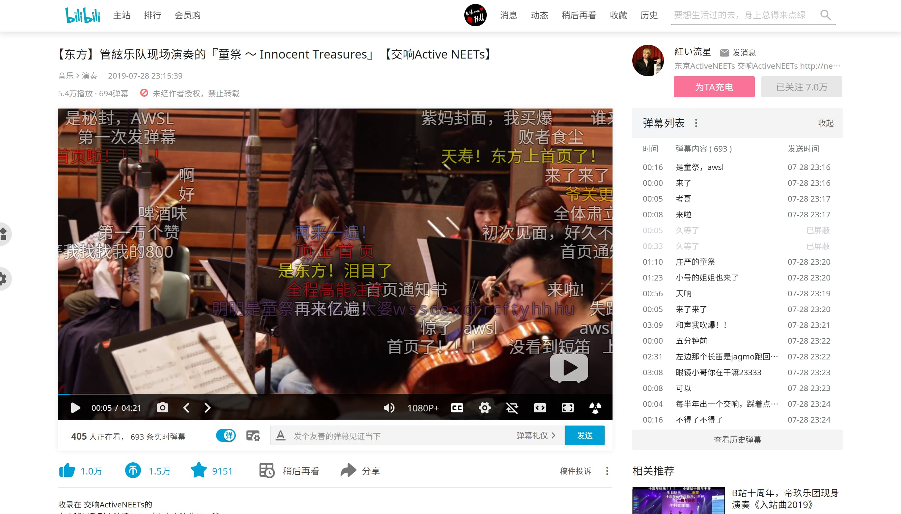
#### 启用后
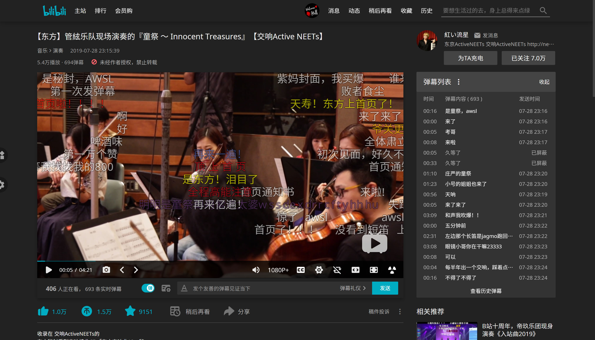
#### 夜间模式计划时段
设置一个使用夜间模式的时间段, 进入/离开此时间段时, 会自动开启/关闭夜间模式.
> 结束时间小于起始时间时将视为次日, 如`18:00`至`6:00`表示晚上18:00到次日6:00.
### 首页使用紧凑布局(实验性)
设置首页是否使用紧凑布局, 视频的间距会减小并削去圆角, 番剧的图片和排名序号会变成圆形, 分区栏的图标会使用高清重制版. 目前仅支持首页, 其他分区的样式后续会添加.
#### 启用前
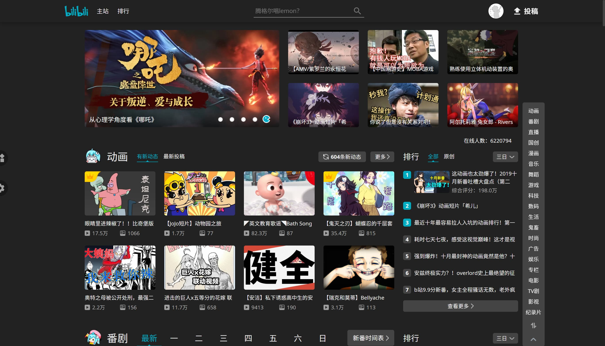
#### 启用后
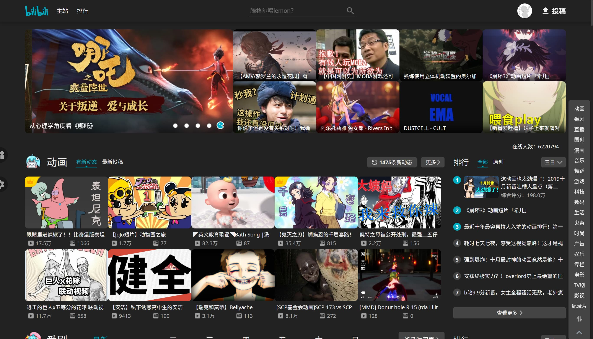
### 简化评论区
- 删除热评头像下方的关注按钮
- 删除用户的等级标识
- 删除发送源信息(`来自安卓客户端`这种)
- 发送时间移动到右上角
- 位图图标全部换用矢量图标, 高分屏不会模糊

> 关注和等级可以通过鼠标停留在头像上, 在弹出的资料卡小窗中查看

### 搜索栏置顶
在主站中总是把搜索框置于顶栏, 如果页面里没有搜索栏则不会显示. 仅对常用页面有效, 部分页面可能会有点布局错乱.
#### 启用前

#### 启用后

#### 显示顶部横幅
在搜索栏置顶启用的时候, 还可以使用此功能显示/隐藏顶部横幅.

#### 显示排行榜图标
在搜索栏置顶启用的时候, 还可以使用此功能显示/隐藏排行榜入口.

### 模糊视频控制栏背景
模糊视频控制栏背景, 原版的阴影效果将无效.
此功能需要浏览器支持背景模糊效果, 详情见[兼容性](#兼容性)一节.
#### 启用前
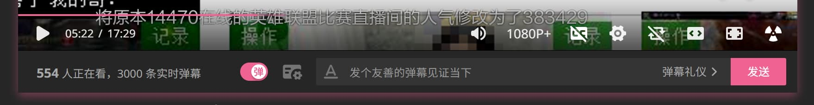
#### 启用后
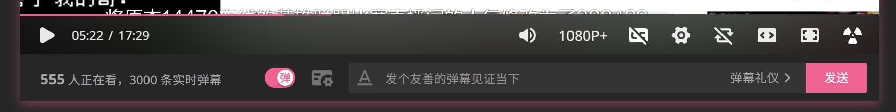
### 控制栏着色
给视频控制栏附上半透明的黑色, 代替原来的阴影, 黑色的不透明度可在设置中调整.
#### 启用前

#### 启用后
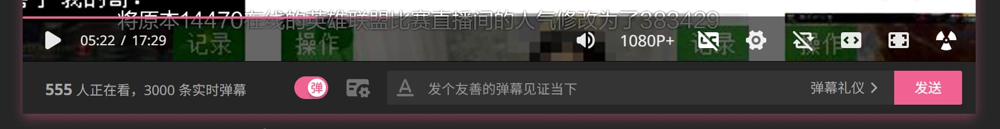
### 缩放直播看板娘
根据屏幕DPI缩放直播看板娘的大小以提高像素的清晰度, DPI缩放为100%的用户不需要此功能.
### 删除直播水印
删除观看直播时角落的水印.
### 删除视频覆盖层
删除视频里鼠标经过时出现在右上角的覆盖层.
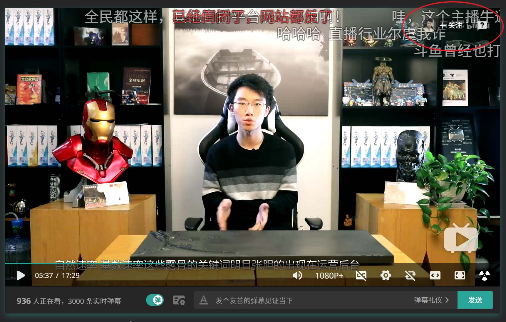

## 工具
### 删除广告
删除站内的各种广告. 包括首页的推广模块, 手机app推荐, 视频页面右侧的广告等.
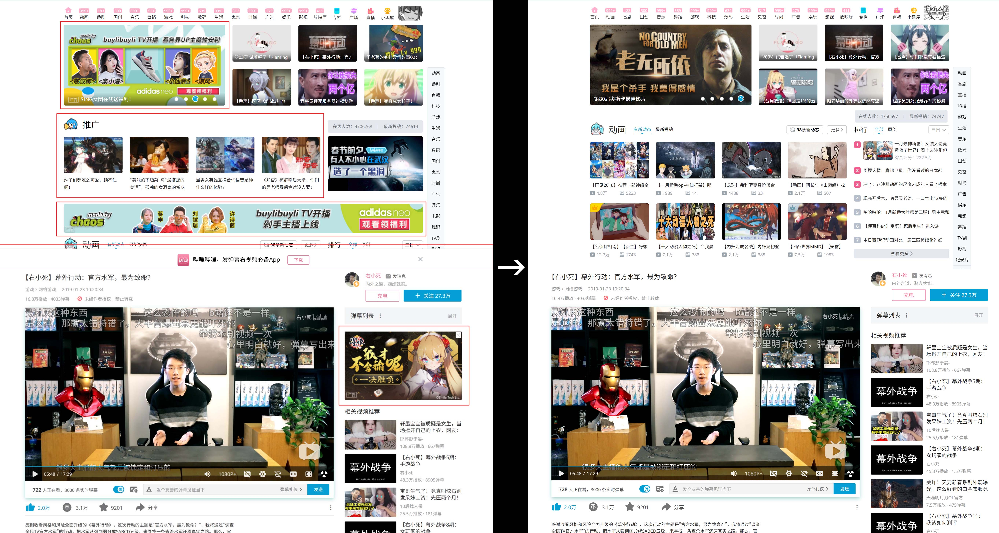
### 稍后再看重定向
将稍后再看的链接重定向为普通播放网址, 以使用新版播放页面.
### 隐藏搜索推荐
将搜索框的推荐词替换为`搜索`.
### 展开动态标题
在顶栏的动态预览框中, 不管名称多长, 总是完全展开up主和视频的标题.

### 展开选集标题
在视频选集列表中, 当标题超出一行时, 另起一行以显示完整标题.
> 因为番剧选集用的绝对布局, 所以此功能在番剧区无效.

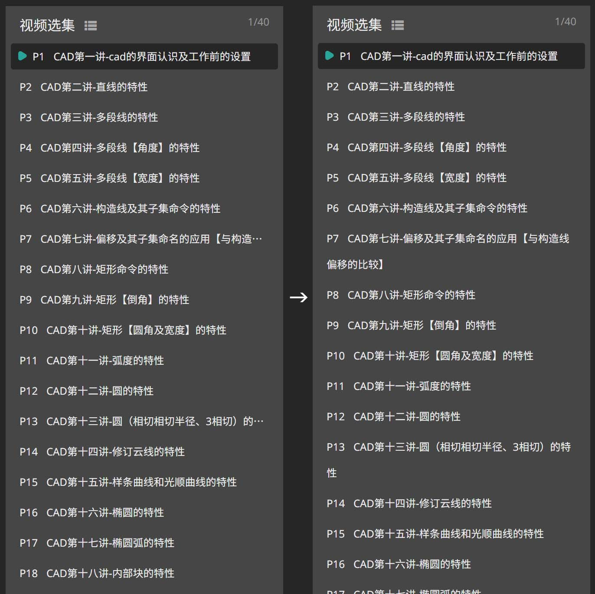
### 直播间勋章快速切换
在直播区(live.bilibili.com)中, 可从`附加功能`中直接切换勋章和头衔.
### 显示失效视频信息
在个人空间中, 为已失效视频恢复标题和封面. 也可以使用`失效视频重定向`转到[BiliPlus](https://biliplus.com)观看.

## 触摸
### 顶栏
删除顶栏右侧的一级链接(从`大会员`到`历史`), 以方便触屏设备快速预览信息. 被删除的链接可从各预览中的`查看更多`进入.
### 素质三连
为素质三连(长按点赞)启用触摸支持.
### 播放器
- 增大控制栏的按钮间距, 使触摸操作更准确.
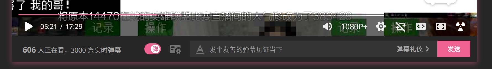
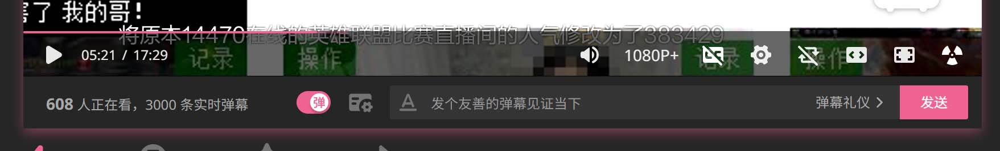
- 启用触摸手势
    - 左右滑动可调整进度
    - 上下滑动可调整音量
    - 进度调整可在左上角和右上角取消
    - 在不同位置滑动, 可以使用3档不同的灵敏度.

#### 启用双击控制
将操作方式更改为: 单击显示/隐藏控制栏, 双击播放/暂停.

## 其他
关于脚本自身的一些设定.
### 显示消息
允许在网页左下角显示来自本脚本的消息, 如更新提醒, 错误提示等.
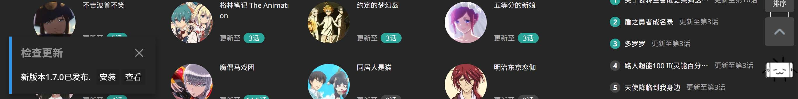
#### 显示内部错误消息
开启后, 错误消息将显示详细的技术性错误信息及堆栈跟踪, 这通常用于准确地确定问题发生的原因, 所以报告问题时这些信息会非常有用.
### 启用缓存
使用缓存以提高脚本的加载速度, 此选项只对非离线版有效, 可在`附加功能`中清除脚本的缓存.

# 兼容性
## 脚本管理器
### [Tampermonkey](https://tampermonkey.net/)
完全兼容.
### [Violentmonkey](https://violentmonkey.github.io/)
不支持多标签页设置同步. (开两个标签页, 在其中一个里改动设置, 另一个标签页的设置不会更新)
### [Greasemonkey](https://www.greasespot.net/)
不支持, 请使用以上的两种管理器.

## 浏览器
### Chrome
- 背景模糊效果([backdrop-filter](https://developer.mozilla.org/en-US/docs/Web/CSS/backdrop-filter))需要手动在`chrome://flags/#enable-experimental-web-platform-features`中开启.
- 含有背景模糊效果的动画有掉帧现象.
### Firefox
- 滚动条样式无效.
- 背景模糊效果无效.
- 触摸调整的进度预览有弹跳现象.(来自CSS `transition`. 短时间内总是从原数值开始变化, 而不是当前数值)
### Safari
- 尚未在Safari中测试.(流下了贫穷的泪水
### Edge [**停止支持**]
- 滚动条样式无效.
- 由于Edge的CSS渲染bug(主要集中在`filter`和`color`), 部分主题颜色错乱.
- 顶栏触摸体验不佳.
- 触摸功能需要手动在`about:flags`中开启.
- 夜间模式部分无效.
- 部分半透明颜色无效.

**喜欢的话就点个⭐Star吧(°∀°)ﾉ**

[返回顶部](#Bilibili-Evolved)