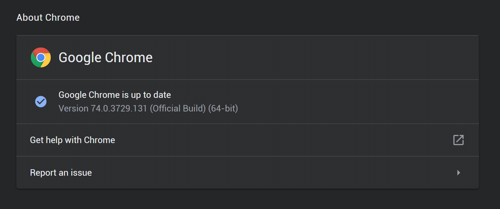
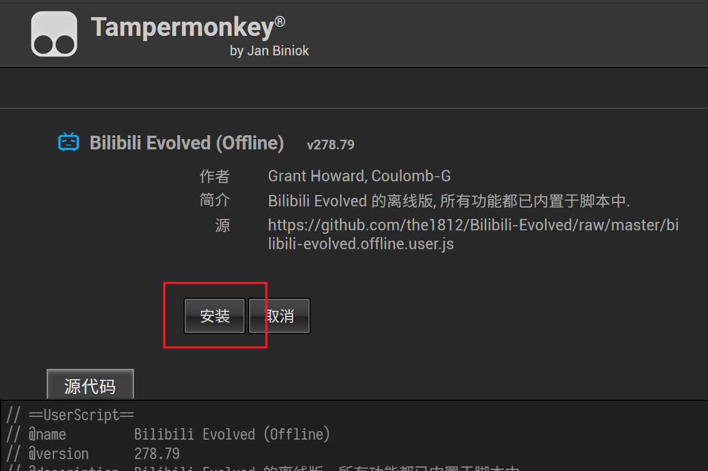
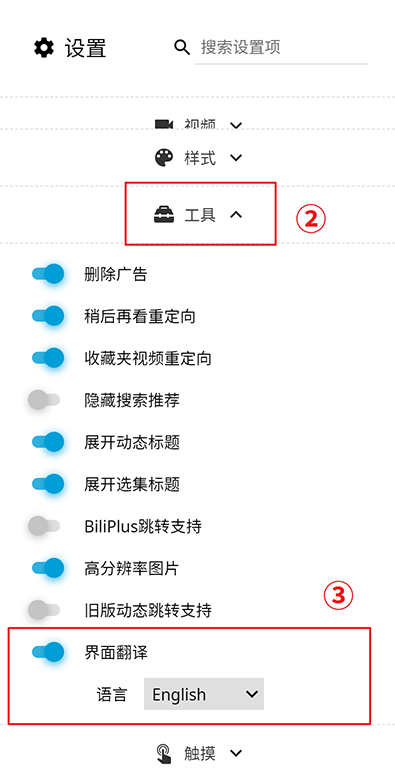

# インストールの説明
この説明では、ブラウザに「Bilibili-Evolved」をインストールするのに役立ちます.

## 1. インストール前の注意
ブラウザが「Bilibili-Evolved」の互換性を確保するよう、下記互換性情報をチェックしてください.

> 簡単に言えば、Chrome、Edge (Chromium)、Firefox、Safariがサポートされています.下記の注意事項のほとんどは、それらの機能に影響を与えません.

### Chrome / Edge (Chromium)
- 背景ぼかし効果([backdrop-filter](https://developer.mozilla.org/en-US/docs/Web/CSS/backdrop-filter))を使用するには 、このページで手動で有効にする必要があります `chrome://flags/#enable-experimental-web-platform-features`. (For Edge, change `chrome` to `edge`)
- 背景ぼかし効果は、アニメーションのフレームドロップを引き起こす可能性があります.
- もし、君の Chrome のバージョンが ≥ 73と画面 DPI/ページのズームが 100% よりも大きい、背景ぼかし効果が正しく表示されない. 詳しい原因はこのページ [Chromium Issue #942910](https://bugs.chromium.org/p/chromium/issues/detail?id=942910) をご覧ください.
### Firefox
- 背景ぼかし効果が無効です、詳しい原因はこのページ [Bugzilla #1178765](https://bugzilla.mozilla.org/show_bug.cgi?id=1178765) をご覧ください.
- タッチジェスチャの使用時にアニメーションの現象があります. (原因は CSS `transition`. プロパティ値は現在値ではなく、常に初期値から変更する)
### Safari
- Safari でテストされない. (私はMacを持っていません)
### Edge (UWP) [**サポート停止**]
- 上記のブラウザを使用してください. あるいはこの[Chromium-based Edge](https://microsoftedgeinsider.com/)に切り替えることができます.

下記のチュートリアルでは、例として Chrome を使用します:

## 2. インストール前の準備
> ユーザースクリプトマネージャ(user script manager)が既にある場合は、このステップをスキップします.

「Bilibili-Evolved」は、JavaScriptコードスニペットとして提供されています。ビリビリにアクセスして個人設定を保持するたびにコードを実行できるように、ユーザースクリプトマネージャーが必要です.

サポートされているマネージャ: [Tampermonkey](https://tampermonkey.net/) と [Violentmonkey](https://violentmonkey.github.io/).

お好きなマネージャを選択して、リンクをクリックして、そのホームページにアクセスするか、ブラウザの拡張ストアにアクセスしてください.
> Greasemonkeyという別のマネージャを知っているかもしれませんが、残念ながらそれはサポートされていません.

例えば、Chrome Web StoreからTampermonkeyをインストールする.

## 3. インストール
少なくとも1つのユーザスクリプトマネージャをインストールしたら、「Bilibili-Evolved」のバージョンを選択してインストールできます. (インストールしたいバージョンの名をクリックしてください)

| [公式版](https://github.com/the1812/Bilibili-Evolved/raw/master/bilibili-evolved.user.js) | [プレビュー版](https://github.com/the1812/Bilibili-Evolved/raw/preview/bilibili-evolved.preview.user.js) | [オフライン版](https://github.com/the1812/Bilibili-Evolved/raw/master/bilibili-evolved.offline.user.js) | [プレビュー・オフライン版](https://github.com/the1812/Bilibili-Evolved/raw/preview/bilibili-evolved.preview-offline.user.js) |
| ----------------------------------------------------------------------------------------- | --------------------------------------------------------------------------------------------------- | -------------------------------------------------------------------------------------------------- | ------------------------------------------------------------------------------------------------------------------- |
| 安定した機能を提供しますが、頻繁には更新されません.                                     | 新機能はここでテストされ、より頻繁に更新されます.                                              | GitHubサーバーの問題を回避するためにすべての依存関係をインライン化しました.                                          | その名の通り、プレビュー＋オフライン.                                                                                |

> ⚠ 時々には、破壊的な大きな更新は、古いスクリプトが完全に使用できなくなります、適時に更新を確認してください.

例えば、オフライン版をインストールする

## 4. 翻訳言語を変更する (オプション)
> 翻訳言语は自分自身のブラウザのデフォルト言语に自动的に设定します.それがなければ、このステップに従って表示言语を変えることができます.

ビリビリを访ねると、ページの左側に2つのアイコン(追加機能と设定)があるはずです.アイコンをクリックすることで設定を展開きます.

今の言語が簡体字中国語（デフォルトのフォールバック言語）であると仮定し、 `工具`(道具)を展開し、 `界面翻译`(インタフェース翻訳)を見つけます.

有効にして見たい翻訳言語を選択してからページを更新します.

例えば、ターゲット言語として英語を選択してください

## 5. 最後
今、準備万端です！ 設定や追加機能を探索して興味深い機能を発見できます.もし、新しい機能とバグを提案したり、私のGitHub repoに報告してください.