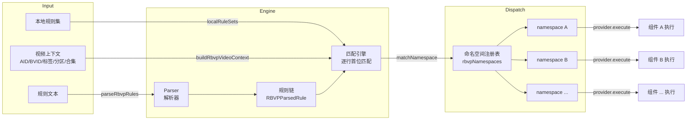

# RBVP — 通用规则视频策略

RBVP (Rule-Based Video Policy) 是一个基于规则匹配的视频策略调度引擎。它独立于任何具体行为（如倍速、画质、弹幕等），只负责根据规则条件识别当前视频，然后将匹配到的动作分发给对应的命名空间（组件）执行。

## 架构概览



三层解耦：

1. **Matcher（匹配层）**：识别视频属性——`UP`、`TAG`、`PARTITION`、`TITLE`、`TIME`、`RULE-SET` 等
2. **Dispatcher（调度层）**：引擎逐行扫描规则，首位匹配即停止，将动作分发给对应命名空间
3. **Action/Namespace（行为空间）**：各组件按 `namespace:value` 格式接收动作，自行解析并执行

## 规则语法

规则为纯文本，每行一条，使用逗号分隔。支持 `#` 行注释。

```
[匹配条件], [动作]
```

### 基础匹配

```
匹配类型, 匹配参数, 命名空间:动作值
```

示例：

```
# 根据视频标题进行匹配，命中后应用 1.5 倍速
TITLE, 教程, rememberVideoSpeed:1.5

# 根据 UP 主 UID 匹配，命中后应用 2 倍速
UP, 123456, rememberVideoSpeed:2.0

# 匹配合集条目标题，同时控制倍速和记忆合集开关
SECTION-NAME, OP, {rememberVideoSpeed:1.0, rememberVideoCollection:true}

# FINAL 是兜底规则，没有匹配参数，始终命中
# 适合放在规则列表末尾作为未匹配任何规则时的回退方案
FINAL, rememberVideoSpeed:MEMORY_GLOBAL
```

### 逻辑组合

支持 `AND`、`OR`、`NOT` 嵌套条件：

```
AND, (条件1), (条件2), 动作
OR, (条件1), (条件2), 动作
NOT, (条件), 动作
```

示例：

```
# 同时满足视频标题以"速通"开头（正则）且 UP 为指定 UID，应用 1.5 倍速
AND, (TITLE, /^速通/), (UP, 123456), rememberVideoSpeed:1.5

# 满足任一条件即命中
OR, (PARTITION, 影视), (TAG, 电影), rememberVideoSpeed:1.0

# 排除指定标签
NOT, (TAG, 4K), rememberVideoSpeed:1.25
```

### 多动作

同一条规则触发多个命名空间时，使用花括号：

```
UP, 666, {rememberVideoSpeed:1.0, otherNamespace:value}
```

### TAG-MUSIC 音乐标签匹配

`TAG-MUSIC` 匹配视频的音乐标签（BGM 等），参数格式与其他文本匹配类型一致：

```
# 若视频带有任意音乐标签，则使用 1x 倍速
TAG-MUSIC, /.*/, rememberVideoSpeed:1.0
```

## 匹配器类型

| 类型                | 匹配方式   | 参数说明                                                                              |
| ------------------- | ---------- | ------------------------------------------------------------------------------------- |
| `BVID`              | 精确匹配   | 视频 BVID，可追加 `#分P` 指定分 P（如 `BV1xx411c7mD#2`）                              |
| `AID`               | 精确匹配   | 视频 AID，同样支持 `#分P`                                                             |
| `SECTION`           | 精确匹配   | 合集当前分区的 section id                                                             |
| `SECTION-ROOT`      | 精确匹配   | 合集根分组 id                                                                         |
| `SECTION-NAME`      | 文本匹配   | 合集条目标题（对应 ugcSeason episodes title）                                         |
| `SECTION-ROOT-NAME` | 文本匹配   | 合集标题（对应 ugcSeason title）                                                      |
| `UP`                | 精确匹配   | UP 主 UID                                                                             |
| `TAG`               | 文本匹配   | 视频标签，大小写不敏感                                                                |
| `TAG-MUSIC`          | 文本匹配   | 视频音乐标签（BGM 等），匹配 `musicId`，大小写不敏感                                   |
| `PARTITION`         | 精确匹配   | 分区 ID（tid）                                                                        |
| `TITLE`             | 文本匹配   | 视频标题，大小写不敏感                                                                |
| `PART`              | 文本匹配   | 分 P 标题，大小写不敏感                                                               |
| `TIME`              | 表达式匹配 | 视频时长（秒）。支持 `>value` `<value` `>=value` `<=value` `=value` 或 `min-max` 范围 |
| `RULE-SET`          | 引用规则集 | 引用本地规则集名称，由规则集内部的条目和匹配类型进行判定                              |
| `FINAL`             | 始终命中   | 不需参数，作为兜底规则                                                                |

> **注意**：`TITLE`、`TAG`、`TAG-MUSIC`、`PART`、`SECTION-NAME`、`SECTION-ROOT-NAME` 均为**文本匹配**类型，大小写不敏感。文本匹配参数支持三种格式：
>
> - `/正则/` — 正则表达式匹配（如 `/^速通.*$/`）
> - `"精确"` — 精确匹配（如 `"4K"`）
> - `模糊` — 模糊匹配，包含即命中（如 `速通`）

## 动作格式

动作格式为 `namespace:value`，命名空间不可省略。

```
rememberVideoSpeed:1.5
otherNamespace:someValue
```

若省略冒号（如 `1.5`），解析器会直接报错 `动作缺少命名空间`。

多动作使用花括号包裹：

```
UP, 666, {rememberVideoSpeed:1.0, otherNamespace:value}
```

动作值由各命名空间的 provider 自行解析，RBVP 引擎不做语义约束。

## 本地规则集

本地规则集是一组可复用的匹配条目（纯 ID/关键词列表），存储为 JSON 对象。每个规则集包含：

- **matcherType**：条目匹配的方式（BVID/AID/UP/TAG/PARTITION/TITLE/PART 等）
- **entries**：字符串数组，每行一条匹配目标

规则在规则文本中通过 `RULE-SET, 规则集名称` 引用。引擎会遍历规则集的 entries，按照其声明的 matcherType 逐条检查视频上下文，任一条目命中即视为该规则集命中。

规则集支持 JSON 格式的导入/导出（含文件下载）。导入时按名称合并，同名规则集会被覆盖。

## 执行流程

1. **视频切换时触发**：通过 `videoChange` 监听，或组件主动调用 `runtime.requestApplyRules()`
2. **准备命名空间**：检查所有已注册 namespace 的 `setup()` 和 `prepare()` 钩子
3. **解析规则文本**：`parseRbvpRules()` 将文本解析为规则链（`RBVPParsedRule[]`）
4. **构建上下文**：`createRbvpEngineContext()` 异步获取视频元数据（AID、BVID、标签、分区、合集结构等）并缓存
5. **逐命名空间匹配**：对每个命名空间，从规则链第一行开始扫描：
   - 若该行 matcher 命中 → 查找是否有该命名空间的 action → 有则执行并返回
   - 若 matcher 不命中或无对应 action → 继续下一行
   - 若执行过程中抛出异常 → 记录错误并继续尝试下一行
   - 所有行都未命中 → 该命名空间无匹配
6. **结果反馈**：可通过 Toast 提示命中结果（可配置开关），调试信息写入 `lastDebugInfo`

## 命名空间注册

RBVP 通过 `registerAndGetData('rbvp.namespaces')` 维护一份命名空间注册表。外部组件只需在此注册 `RBVPNamespaceProvider` 即可接入：

```typescript
// RBVPNamespaceProvider 接口
interface RBVPNamespaceProvider {
  displayName: string // 显示名称
  primaryName?: string // 主命名空间名（缺省使用注册 key）
  aliases?: string[] // 别名列表（同样可用于动作匹配）
  description?: string // 描述文本
  setup?: (runtime: RBVPRuntime) => void // 一次性初始化
  prepare?: (context) => void // 每次匹配前预处理
  getTakeoverState?: () => boolean // 读取接管开关
  setTakeoverState?: (value: boolean) => void // 设置接管开关
  validateAction?: (rawValue: string) => void // 校验动作值
  resolveAction: (rawValue, context) => RBVPResolvedAction | null // 解析动作
  execute: (action, context) => string | void // 执行动作
}
```

命名空间匹配时会将名称中的 `-` 和 `_` 去除后做大小写不敏感比对，因此 `rememberVideoSpeed`、`remember-video-speed`、`REMEMBER_VIDEO_SPEED` 等效。

## 设置 UI

RBVP 提供独立的设置弹窗，包含三个标签页：

- **规则**：支持可视化视图（卡片式拖拽排序、展开/收起、标题编辑）和文本视图（直接编辑规则文本），另有上下文视图查看当前视频的匹配上下文，调试视图查看最近一次匹配的逐步骤追踪
- **规则集**：创建、编辑、删除本地规则集，支持 JSON 导入/导出
- **命名空间**：查看已注册的命名空间及其别名、描述，支持启用/关闭组件接管
